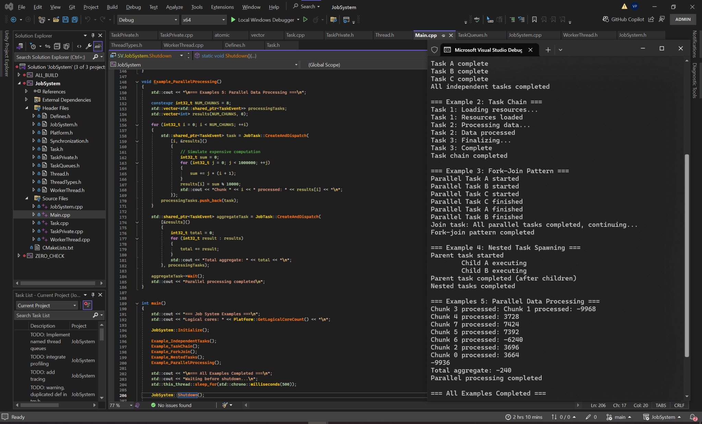

# JobSystem

A lightweight, standalone C++ job system prototype designed to be integrated into a game engine. 

Inspired by Unreal Engine's Task API and the *Multiprocessor Game Loops* chapter in *Game Engine Architecture* (by Jason Gregory), this is an initial prototype implementing prerequisite dependency graphs, task chaining, and worker thread pools with work-stealing.

## Features

- **Task Graph & Dependencies:** Support for prerequisite-based task chains, fork-join patterns, and nested task spawning via `TaskEvent`.
- **Worker Thread Pool:** Dynamic core detection with dedicated worker threads and lock-free/work-stealing queues.
- **Named Threads Support:** Ability to target specific engine threads or general worker pools.
